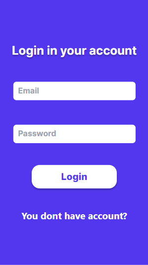
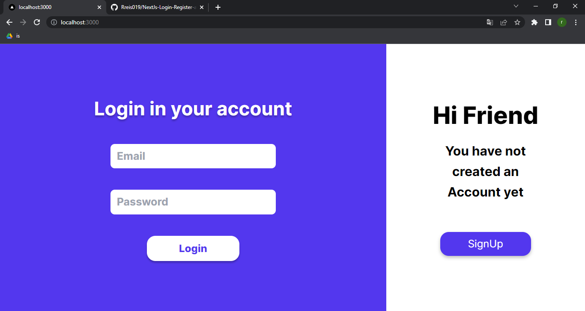
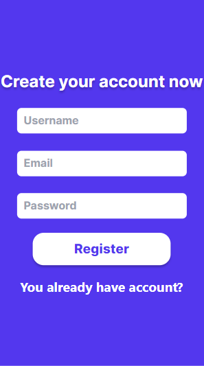
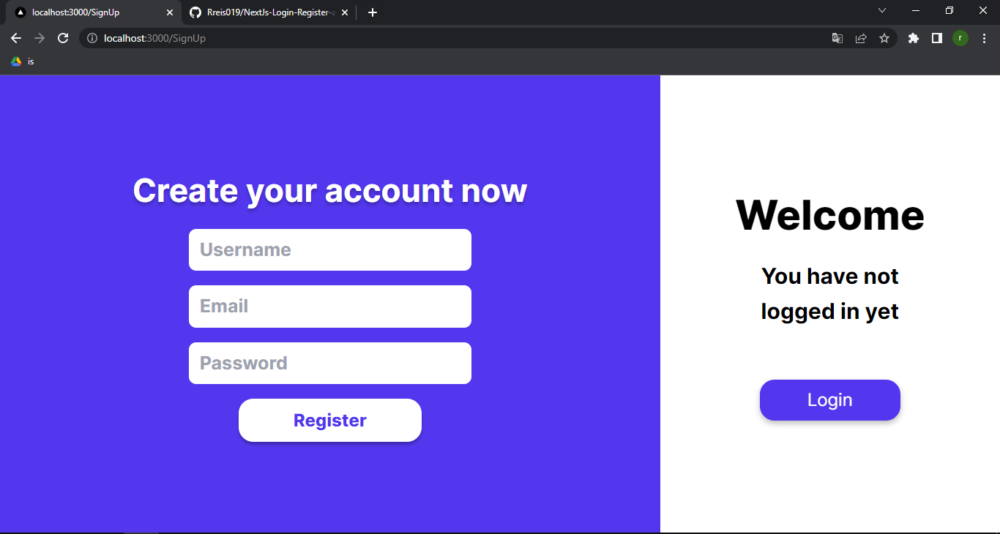
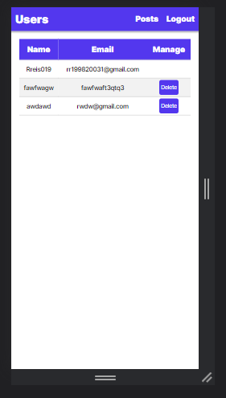
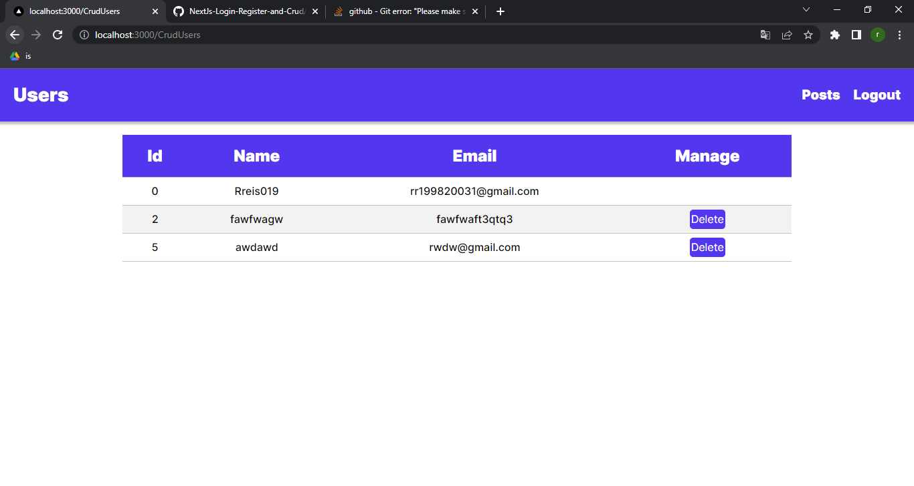
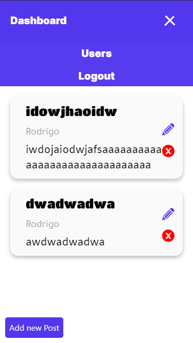
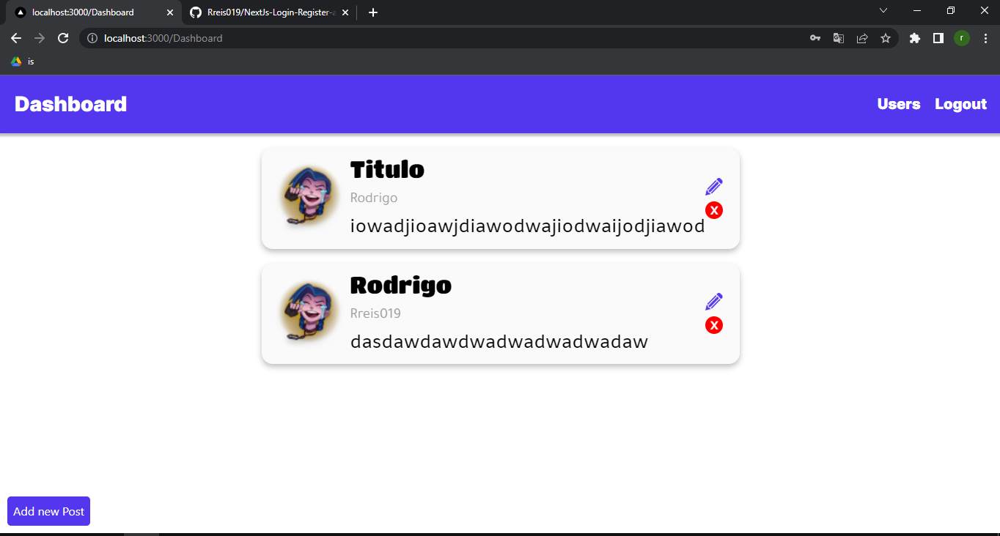

<h1>Description</h1>
Second project done in internship with the aim of learning how to use NextJs framework, TailWind and others. In this branch a project is done with login, registration and crud, but without backend, i.e. user data is stored locally.

<h1>How to run</h1>
<p>Open cmd go to the project directory and do</p>

```
 npm run dev
```

<h1>Screenshots</h1>

| Mobile                                                    | PC                                             |
|:----------------------------------------------------------|:-----------------------------------------------|
|                   |               | 
|        |            | 
|                   |           | 
|               |            |

